# 阿里云服务器领取并配置环境

## 一. 服务器的免费领取

### 1. 先到阿里云学生的活动页面登录领取14天

```java
https://developer.aliyun.com/plan/student#J_5144437010  //领取网页 
```

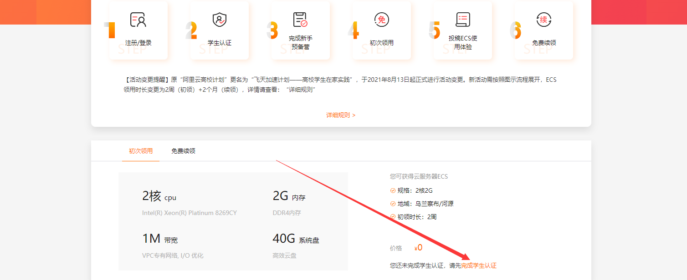

点击这里进行领取，如果没有进行学生认证的话，先在支付宝进行学生的认证。认证之后，跳转到到完成新手营界面，进行服务器的新手训练，按照提示操作即可，还有一个十道题的小测验，答案我放在下方的链接,如果没有可以自行百度：

```java
https://blog.csdn.net/qq_35834501/article/details/106539233

https://blog.csdn.net/qq_45037404/article/details/104552886

https://blog.csdn.net/Miracle_ps/article/details/104555821

https://wenku.baidu.com/view/e8fdd626a5c30c22590102020740be1e640ecc59.html
```

完成上述的任务就可以领取14天的ECS服务器啦！

### 2. 投稿并续领两个月的ECS

点击免费续领：


跳转到以下页面：

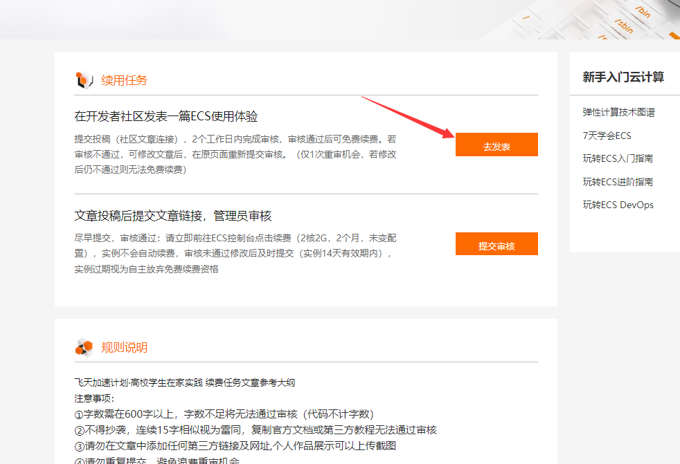

按照要求水一篇小文章，markdown格式，在社区发布，发布后把链接给管理员审核通过即可续费两个月！

### 二 .服务器的基本操作和软件安装

### 1. 通过命令安装宝塔面板

首先获取该实例的密码，如果不记得可以去下面网页一键重置

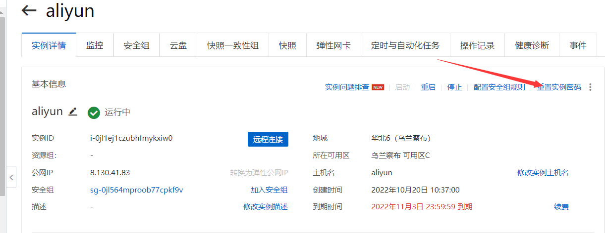

通过SSH进行远程登录ECS，可以用阿里云控制台远程登录

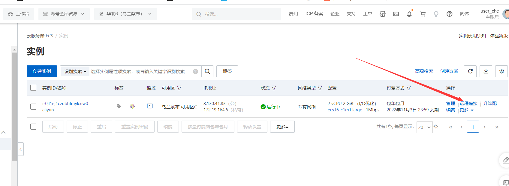

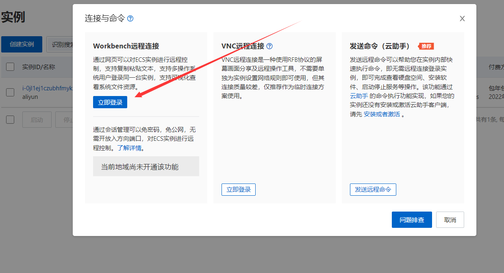

访问失败的去安全组看下22端口是否开放

也可以安装远程连接软件，软件用起来会比阿里网页这个流畅一些，在这里我用的是Terimius工具，须要输入服务器ip地址

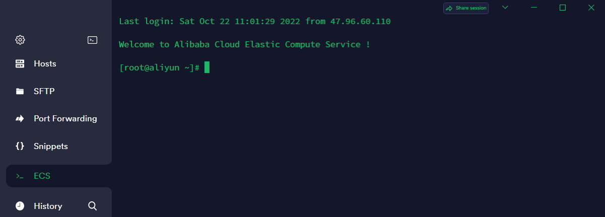

接下来我们去官网找到宝塔面板相应系统的下载命令复制后直接在命令行输入

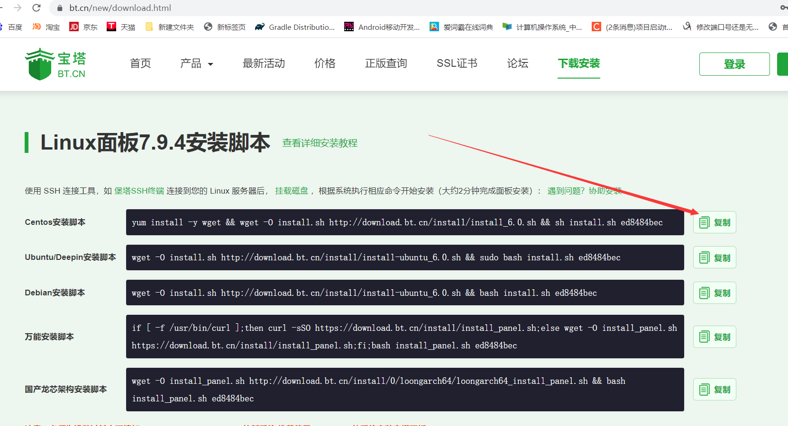

输入该命令行后，服务器开始安装宝塔面板，耐心等待一会这里会有两次询问，输入y和yes就可以完成下载，出现以下的图片就说明宝塔面板安装成功！记得把红框内的内外网地址和用户名密码保存起来，可以放在记事本中，用到了就去看一下。

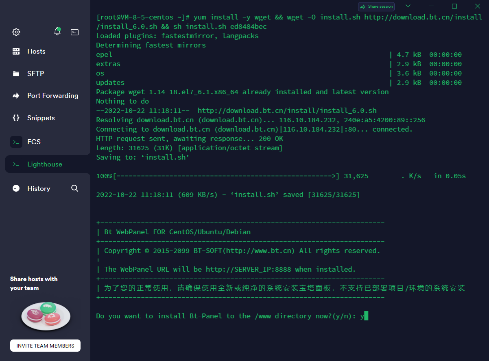

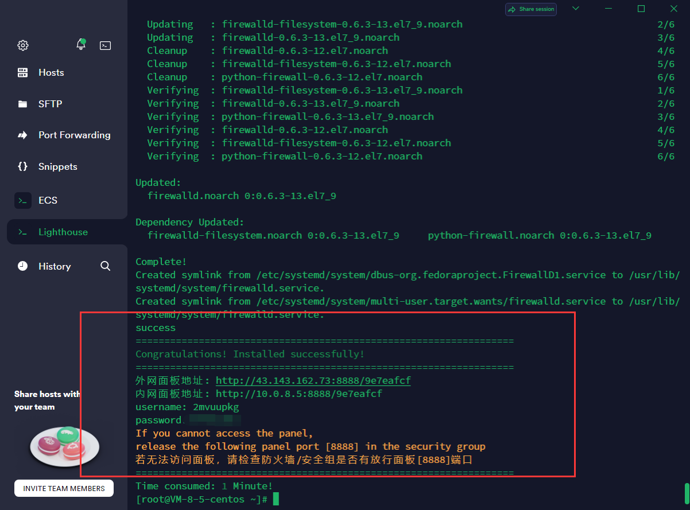

接下来我们把上图出现的外网地址复制到浏览器，并输入上面写的用户名和密码

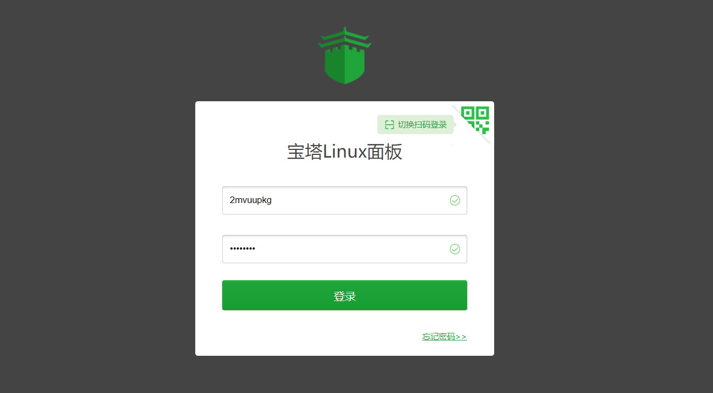

如果登录不上，去检查一下控制台安全组有没有放行宝塔的端口号。

登录进去以后，要绑定你的宝塔账号，如果没有先注册一个

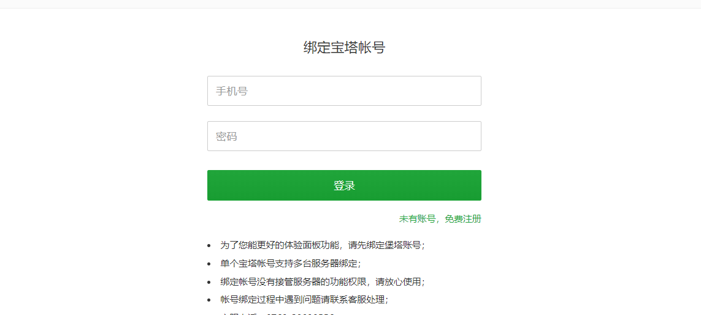

注册完毕后，会弹出弹窗，在这里你可以勾选自己须要的应用进行快速安装,也可以一会去左侧导航栏里面的软件商店搜索安装

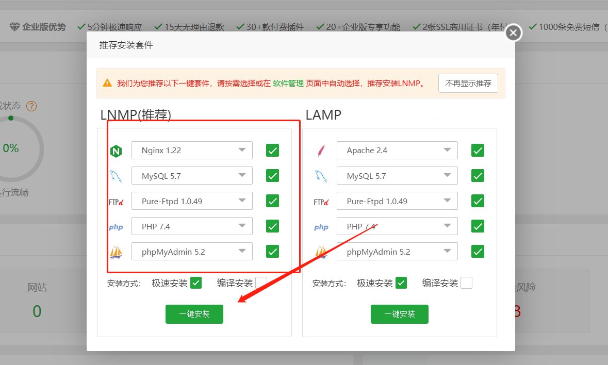

###  2.配置并用Navicat连接ECS的mysql

在宝塔面板下载好mysql之后，点击左侧导航栏数据库，获取到root密码后，在命令行输入mysql -u root -p登录到mysql中

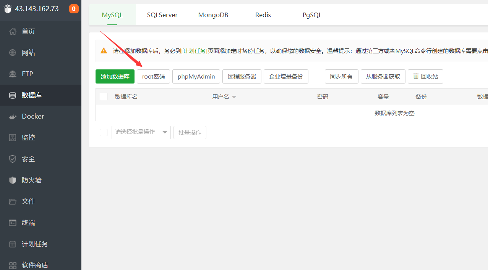

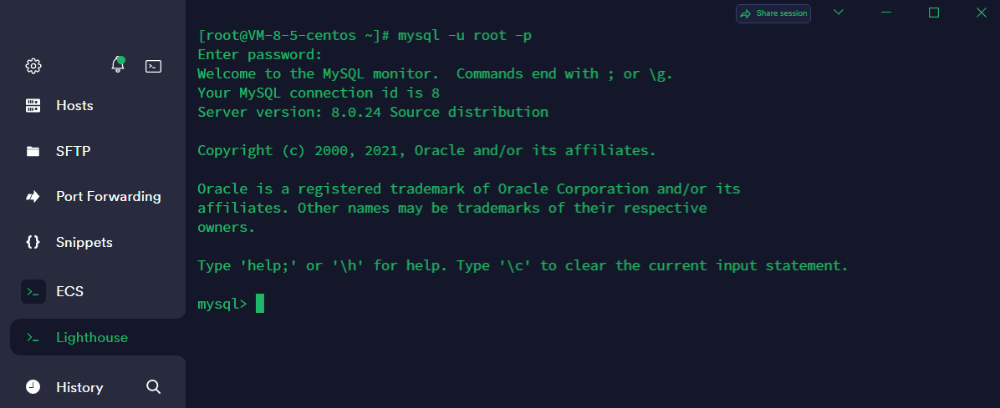

因为mysql现有的用户都是localhost的，所以须要创建一个可以远程访问的mysql用户

```shell
create user '用户名'@'允许那个主机链接' identified by '密码';           // 创建新用户 %  主机名为所有主机可以连接
grant all privileges on *.* to '用户名'@'主机名' with grant option;   //授予该用户若有权限
flush privileges;                                                   //刷新权限
quit                   //退出mysql
service mysqld restart //重启mysql
```

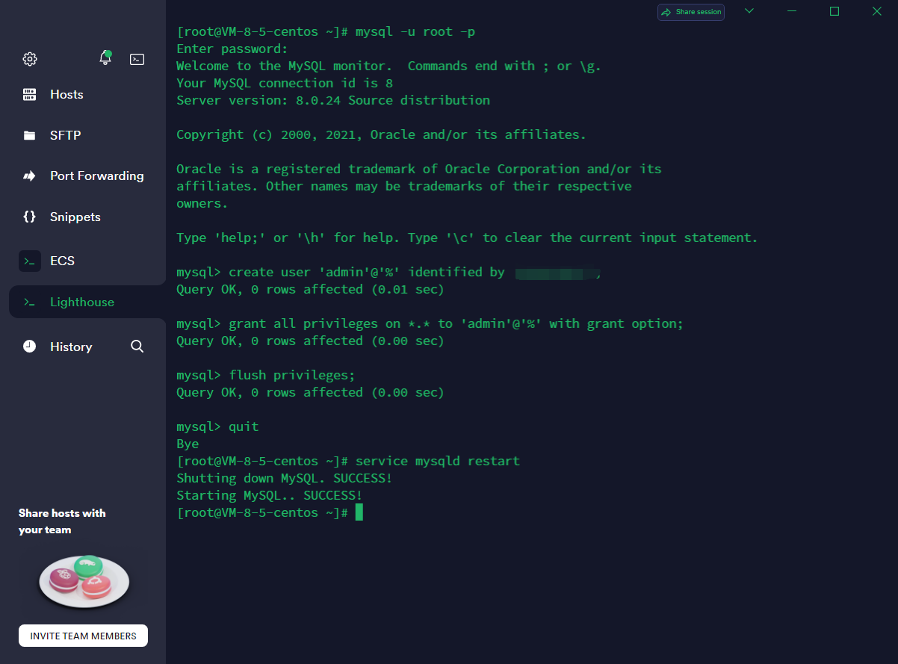

因为centos自带防火墙，所以还要在centos中放行tcp3306端口

```shell
firewall-cmd --list-all   // 查看开放的端口号
firewall-cmd --zone=public --add-port=3306/tcp --permanent   // 开放3306端口
firewall-cmd --reload		// 重启防火墙
firewall-cmd --list-all     //查看是否生效
```

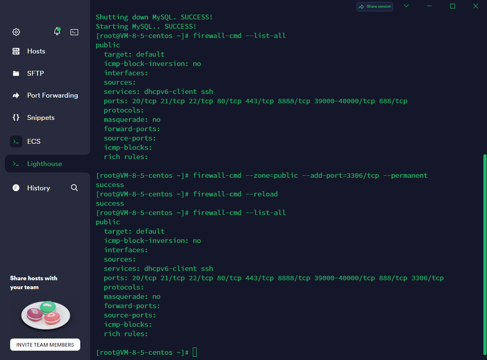

接下来就用创建好的用户名和密码通过Navicat进行连接mysql,连接名可以任意

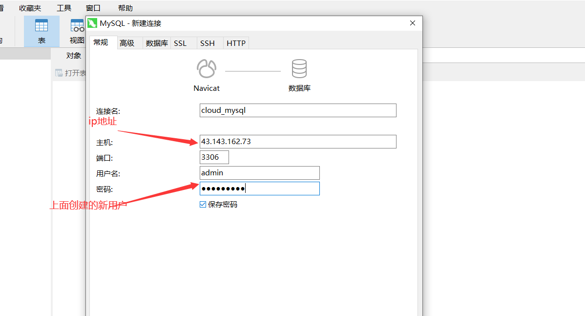

连接成功！


